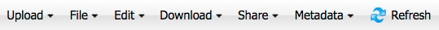

.. include:: cyverse_rst_defined_substitutions.txt
|CyVerse logo|_

|Home_Icon|_
`Learning Center Home <http://learning.cyverse.org/>`_

==================================
**Managing Data Files and Folder**
==================================

The Data window contains both input data files that are used in analyses and output data files that are returned as the result of completed analyses. 
Input data files can be uploaded or imported to your personal workspace from your desktop or from URL, as well as made available by other users in the Community Data folder and `shared <https://wiki.cyverse.org/wiki/display/DEmanual/Sharing+and+Unsharing+Data+Files+and+Folders+in+the+DE>`_ with others.

This section discusses how to organize and maneuver data files and folders in your Data window, including viewing and changing the file's info-type.

For information on using data files in your analyses, see `Submitting an Analysis <https://wiki.cyverse.org/wiki/display/DEmanual/Submitting+an+Analysis>`_.

You can access and manage data from outside the DE as well. For more information, see `Downloading and Uploading Data <https://wiki.cyverse.org/wiki/display/DS/Downloading+and+Uploading+Data>`_.

Opening the Data Window
-----------------------

Click the **Data** icon to open the Data window

Window Icons
------------

.. |helpiconwindow| image:: img/de/HelpIconWindows.png

.. |WindowIcon-cascadeTile| image:: img/de/WindowIcon-CascadeTile.png

.. |WindowIcon-minMaxClose| image:: img/de/WindowIcon-MinMaxClose.png

.. list-table::
    :header-rows: 0

    * - |helpiconwindow|
      - **Help:** Click to open the FAQs page for the current window. 
    * - |WindowIcon-cascadeTile|
      - **Layout:** Resizes the window layout to half of the available available desktop space and positions it either to the left (**Snap Left**) or right side (**Snap Right**) of the window.
    * - |WindowIcon-minMaxClose|
      - Minimize, Maximize, or close the active window. 

----------
Data Menus
----------

The Data toolbar helps you `manage files and folders. <https://wiki.cyverse.org/wiki/display/DEmanual/Managing+Data+Files+and+Folders>`_.

|datamenu|

Upload menu
-----------

    - `Upload (simple and bulk) and import <https://wiki.cyverse.org/wiki/display/DEmanual/Managing+Data+Files+and+Folders>`_ files and folders

File menu
---------

    - `Open a new window in your home folder or at a selected location <https://wiki.cyverse.org/wiki/display/DEmanual/Opening+New+Data+Windows>`_ 
    - `Create a new folder <https://wiki.cyverse.org/wiki/display/DEmanual/Creating+New+Files+and+Folders>`_ 
    - `Create a new file <https://wiki.cyverse.org/wiki/display/DEmanual/Creating+New+Files+and+Folders>`_ including plain text files; tabular data files; R, Perl, Python, and Shell scripts; and Markdown files.
    - `Move a file or folder to Trash <https://wiki.cyverse.org/wiki/pages/viewpage.action?pageId=11446737>`_ 

Edit menu
---------

    - `Rename a file or folder <https://wiki.cyverse.org/wiki/display/DEmanual/Renaming+a+Data+File+or+Folder>`_
    - `Edit files and folders <https://wiki.cyverse.org/wiki/display/DEmanual/Editing+Files+and+Folders>`_
    - `Edit data comments <https://wiki.cyverse.org/wiki/display/DEmanual/Viewing%2C+Adding%2C+and+Retracting+Data+Comments>`_ 
    - `Edit information type <https://wiki.cyverse.org/wiki/display/DEmanual/Editing+a+File%27s+Info-Type>`_ 
    - `Move files and folders <https://wiki.cyverse.org/wiki/display/DEmanual/Moving+a+Data+File+or+Folder>`_ 

Dowload menu
------------

    - `Download a file or folder using Simple or Bulk ownload <https://wiki.cyverse.org/wiki/display/DEmanual/Downloading+Files+and+Folders>`_ 

Share menu
----------

    - `Share a file or folder with collaborators in the DE <https://wiki.cyverse.org/wiki/display/DEmanual/Sharing+and+Unsharing+Data+Files+and+Folders+in+the+DE>`_ 
    - `Create a Public Link to a file <https://wiki.cyverse.org/wiki/display/DEmanual/Sharing+Data+Files+Via+Public+Links>`_ 
    - `Share a folder location <https://wiki.cyverse.org/wiki/display/DEmanual/Creating+Shared+Path+Folder+Links>`_ 
    - View genome files in `CoGe <https://wiki.cyverse.org/wiki/display/DEmanual/Viewing+Genome+Files+in+CoGe>`_ or `Ensembl <https://wiki.cyverse.org/wiki/display/DEmanual/Viewing+Genome+Files+in+a+Genome+Browser>`_, or Newick files in the `Tree Viewer <https://wiki.cyverse.org/wiki/display/DEmanual/Viewing+Newick+Files+in+the+Tree+Viewer>`_. These commands are also available for selected CoGe, Ensembl, or Newick files in the details pane. 

Metadata
--------

    - Use `metadata and metadata templates <https://wiki.cyverse.org/wiki/display/DEmanual/Using+Metadata+in+the+DE>`_, and `request a permanent identifier <https://wiki.cyverse.org/wiki/display/DC/Requesting+a+Permanent+Identifier+in+the+Data+Commons>`_ (DOI or ARK) to allow others to reuse your datasets

Refresh
-------

    - Refresh the Data window if results are not updating as expected.

Search
------

    - Search for a file using `basic or advanced search <https://wiki.cyverse.org/wiki/display/DEmanual/Searching+for+Data+Items>`_.

Trash
-----

    - `Open, restore, empty the trash, or delete data items in the trash <https://wiki.cyverse.org/wiki/pages/viewpage.action?pageId=11446737>`_

-------------------
Using the Data list
-------------------

    - Click in the search field, or paste the path, to search for a file or folder.
    - Click a folder in the Navigation list to displays its contents (files and subfolders) in the middle column.
    - Click a checkbox in the middle pane to view details about the item in the Details section in the right column.

Viewing and selecting files and folders
---------------------------------------

The navigation list in the left pane is where you navigate through data files and folders in your personal workspace. 

    * - Personal folder
      - Click your username folder to `view the list of data items <https://wiki.cyverse.org/wiki/display/DEmanual/Viewing+and+Customizing+Data+Files>`_ you own.
    * - Community Data
      - View the list of data items that have been `shared <https://wiki.cyverse.org/wiki/display/DEmanual/Sharing+Data+Files+and+Folders>`_ by other CyVerse account users.
    * - Shared With Me
      - Click the `shared with me <https://wiki.cyverse.org/wiki/display/DEmanual/Sharing+Data+Files+and+Folders>`_ folder (does not show if no one has shared any items with you) to view data items that have been shared with you by other users.
    * - Trash
      - Click the `Trash <https://wiki.cyverse.org/wiki/pages/viewpage.action?pageId=11446737>`_ folder to view the list of deleted data items, empty the Trash folder to permanently delete all items in the folder, or delete selected items. 
    * - Saved filters
      - If you `saved any search filters <https://wiki.cyverse.org/wiki/display/DEmanual/Searching+for+Data+Items#SearchingforDataItems-_savedSearchFilter>`_, the Saved filters folder is displayed below the Trash folder.
    * - Favorites
      - The list of your `favorite files and folders <https://wiki.cyverse.org/wiki/display/DEmanual/Using+Data+Favorites>`_. 

Understanding inaccessible data items
-------------------------------------

Data items that are inaccessible are displayed in red italicized font.

.. image:: de/img/InaccessibleDataItem.gif

This may be due to special characters (' or ~) in the path or name, or system-level items, such as your iplant/home/shared folder or your home directory. 
These data items cannot be opened, renamed, moved, deleted, or accessed in any way. For more information, see `Using Special Characters in the DE <https://wiki.cyverse.org/wiki/display/DEmanual/Using+Special+Characters+in+the+DE>`_.

Sorting, adding, and hiding columns in the Data list
----------------------------------------------------

You can sort on any column in the Data list, and hide or show columns to customize the look of your Data list.

    1. Hover over the column header until a down arrow appears on the right side of the column, and then click the down arrow:

    .. image:: de/img/ColumnDropdown.png

    2. Click the setting to use

        - To sort the column, click either **Sort Ascending** or **Sort Descending**. 
        - To hide or show a column, point to **Columns**, and then select or clear the checkbox for the column.

    .. tip:: **Need to view the path?** Show the **Path** column to help you determine which file or folder to use in search results. 

**Fix or improve this documentation:**

- On Github: |Github Repo Link|
- Send feedback: `Tutorials@CyVerse.org <Tutorials@CyVerse.org>`_
- Live chat/help: Click on the |intercom| on the bottom-right of the page for questions on documentation

----

|Home_Icon|_
`Learning Center Home <http://learning.cyverse.org/>`_

.. Comment: Place Images Below This Line
   use :width: to give a desired width for your image
   use :height: to give a desired height for your image
   replace the image name/location and URL if hyperlinked

 .. |Clickable hyperlinked image| image:: ./img/IMAGENAME.png
    :width: 500
    :height: 100
 .. _CyVerse logo: http://learning.cyverse.org/

 .. |Static image| image:: ./img/IMAGENAME.png
    :width: 25
    :height: 25

.. Comment: Place URLS Below This Line

   # Use this example to ensure that links open in new tabs, avoiding
   # forcing users to leave the document, and making it easy to update links
   # In a single place in this document

   .. |Substitution| raw:: html # Place this anywhere in the text you want a hyperlink

      <a href="REPLACE_THIS_WITH_URL" target="blank">Replace_with_text</a>

.. |Github Repo Link|  raw:: html

   <a href="FIX_FIX_FIX_FIX_FIX_FIX_FIX_FIX_FIX_FIX_FIX_FIX_FIX_FIX_FIX" target="blank">Github Repo Link</a>
