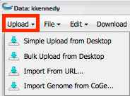

.. include:: cyverse_rst_defined_substitutions.txt
|CyVerse logo|_

|Home_Icon|_
`Learning Center Home <http://learning.cyverse.org/>`_

--------------------
Uploading data items
--------------------

You can upload and import files from your desktop using several different methods:

    - **Simple Upload from Desktop**: Useful for uploading smaller files of up to 1.9 GB per file.
    - **Bulk upload from Desktop**: Upload multiple files using `Cyberduck <https://pods.iplantcollaborative.org/wiki/display/DS/Using+Cyberduck+for+Uploading+and+Downloading+to+the+Data+Store>`_.
    - **Import From URL**: Allows you to past a URL to the file to upload. 

Network bandwidth and current load impacts upload times. For more information on larger files and allocations, see `Downloading and Uploading Data <https://wiki.cyverse.org/wiki/display/DS/Downloading+and+Uploading+Data>`_.

You can also `import files from URL <https://wiki.cyverse.org/wiki/display/DEmanual/Uploading+and+Importing+Data+Items+Within+the+DE#UploadingandImportingDataItemsWithintheDE-importURL>`_ that are larger than 3-4 GB or are not on your computer.

Using Simple Upload from Desktop
--------------------------------

Simple Upload from Desktop is useful when you have smaller files of up to 1.9 GB per file.

    1. Open the **Data** window.
    2. In your personal folder, open the destination folder for the upload. 
    3. Click **Upload** and then click **Simple Upload from Desktop**.
    4. Verify the destination folder (Uploading to) is correct.
        
        .. image:: img/DataSimpleUpload.jpg

        To change the destination folder, click **Cancel**, select the correct folder, and then click **Upload** and **Simple Upload from Desktop** again.
    
    5. In the Upload window, click **Browse** to select the first file to upload.
    6. Repeat for each file to upload. 
    7. Click **Upload**. The files are uploaded to the destination folder. 

Using Bulk Upload from Desktop
------------------------------

Mac and Windows should us `Cyberduck <https://wiki.cyverse.org/wiki/display/DS/Using+Cyberduck+for+Uploading+and+Downloading+to+the+Data+Store>`_ for downloading bulk files, where Linux users may want to use `iDrop Desktop <https://pods.iplantcollaborative.org/wiki/display/DS/Using+iDrop+Desktop>`_ or `iCommands <https://pods.iplantcollaborative.org/wiki/display/DS/Using+iCommands>`_.
You also may still upload or import files within the DE using `simple upload or import from URL <https://pods.iplantcollaborative.org/wiki/display/DEmanual/Uploading+and+Importing+Data+Items+Within+the+DE>`_ within the DE. The method you use depends on the size and number of your data files, as well as your personal preferences. 

You can access and manage data from outside the DE as well. For more information, see `Downloading and Uploading Data <https://pods.iplantcollaborative.org/wiki/display/DS/Downloading+and+Uploading+Data>`_.

--------------------
Importing data items
--------------------

Importing From URL
------------------

Use Import from URL when you want to import larger files, have some files you want to upload from desktop and some you want to import from URL, or want to import a file to the DE that isn't on your system. 
You can receive (or not receive) an email when the status of your imported data item changes. See `Using the Preferences Menu <https://wiki.cyverse.org/wiki/display/DEmanual/Using+the+Preferences+Menu>`_ for more information.

----

**Fix or improve this documentation:**

- On Github: |Github Repo Link|
- Send feedback: `Tutorials@CyVerse.org <Tutorials@CyVerse.org>`_
- Live chat/help: Click on the |intercom| on the bottom-right of the page for questions on documentation

----

|Home_Icon|_
`Learning Center Home <http://learning.cyverse.org/>`_

.. Comment: Place Images Below This Line
   use :width: to give a desired width for your image
   use :height: to give a desired height for your image
   replace the image name/location and URL if hyperlinked

 .. |Clickable hyperlinked image| image:: ./img/IMAGENAME.png
    :width: 500
    :height: 100
 .. _CyVerse logo: http://learning.cyverse.org/

 .. |Static image| image:: ./img/IMAGENAME.png
    :width: 25
    :height: 25

.. Comment: Place URLS Below This Line

   # Use this example to ensure that links open in new tabs, avoiding
   # forcing users to leave the document, and making it easy to update links
   # In a single place in this document

   .. |Substitution| raw:: html # Place this anywhere in the text you want a hyperlink

      <a href="REPLACE_THIS_WITH_URL" target="blank">Replace_with_text</a>

.. |Github Repo Link|  raw:: html

   <a href="FIX_FIX_FIX_FIX_FIX_FIX_FIX_FIX_FIX_FIX_FIX_FIX_FIX_FIX_FIX" target="blank">Github Repo Link</a>
