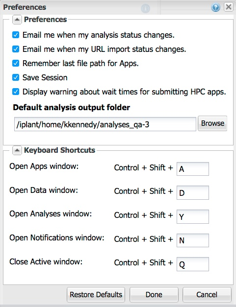
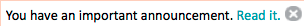

.. include:: cyverse_rst_defined_substitutions.txt
|CyVerse logo|_

|Home_Icon|_
`Learning Center Home <http://learning.cyverse.org/>`_

**Using the DE: Changing preferences**
~~~~~~~~~~~~~~~~~~~~~~~~~~~~~~~~~~~~~~

**Opening the Preferences settings window**

.. |person_icon| image:: img/de/person_icon.png  
    :width: 2

    
Click |person_icon| at the top right of the window and then click **Preferences:**

**Changing Preferences**

- Email me when my analysis status change
    Click **Notify me by email when my analysis status changes** to receive or stop receiving email notifications when the status of an analysis changes to completed or failed. 
    This is useful when you want to track the status of your analyses while outside of the DE. 
    For more information on notifications, see `Viewing and Deleting Notifications <https://wiki.cyverse.org/wiki/display/DEmanual/Viewing+and+Deleting+Notifications>`_ 
      

**Adding and Deleting Users from the Collaborators List in Preferences**
------------------------------------------------------------------------

The Collaborators list is a "short list" of CyVerse users with whom you frequently share `data files and folders <https://wiki.cyverse.org/wiki/display/DEmanual/Sharing+and+Unsharing+Data+Files+and+Folders+in+the+DE>`_, `analyses <https://wiki.cyverse.org/wiki/display/DEmanual/Sharing+and+Unsharing+an+Analysis>`_, or `unpublished apps <https://wiki.cyverse.org/wiki/display/DEmanual/Sharing+your+App+or+Workflow+and+Editing+the+User+Manual>`_.

Although a user does not have to be in your Collaborators list to share a data file or folder, adding a user to your Collaborators list makes it easier to share.

**Adding a user to your Collaborators list in Preferences**

.. |CollaboratorsWindow| image:: img/de/CollaboratorsWindow.png

1. Click |person_icon| (Preferences) at the top right of the screen.
2. Click **Collaborators**: 

|CollaboratorsWindow|

3. In the search field, enter all or part of the user's name (not case-sensitive).
4. In the results list, click the name to add the name to your Collaborators list.
5. Repeat for each user to add.
6. When done, click **OK**.

The user is now available in your Collaborators list the next time you want to `share selected data files and folders <https://wiki.cyverse.org/wiki/display/DEmanual/Sharing+Data+Files+and+Folders>`_ or `share an unpublished app <https://wiki.cyverse.org/wiki/display/DEmanual/Sharing+your+App+or+Workflow+and+Editing+the+User+Manual>`_ with a user.

        -You can also share with users on the fly:
            - Data items: `Sharing and Unsharing Data Files and Folders in the DE <https://wiki.cyverse.org/wiki/display/DEmanual/Sharing+and+Unsharing+Data+Files+and+Folders+in+the+DE>`_
            - Analysis results: `Sharing and Unsharing an Analysis <https://wiki.cyverse.org/wiki/display/DEmanual/Sharing+and+Unsharing+an+Analysis>`_ 
            - Unpublished apps: `Sharing your App or Workflow and Editing the User Manual <https://wiki.cyverse.org/wiki/display/DEmanual/Sharing+your+App+or+Workflow+and+Editing+the+User+Manual>`_ 

**Deleting a user from your Collaborators list in Preferences**

Removing a user from your Collaborators list removes the user only from the Collaborators list but retains the permission level you have granted for that user to each data item. See `Unsharing Files and Folders <https://wiki.cyverse.org/wiki/display/DEmanual/Unsharing+Files+and+Folders>`_ to removen access to the data items as well.

    1. Click |person_icon| and then click **Collaborators**.
    2. In the Collaborators window, click the checkbox for the user to remove from your Collaborators list, and then click |X-icon|.
    3. Click **OK**.

You can also unshare a `shared data item <https://wiki.cyverse.org/wiki/display/DEmanual/Sharing+and+Unsharing+Data+Files+and+Folders+in+the+DE>`_, `shared analysis <https://wiki.cyverse.org/wiki/display/DEmanual/Sharing+and+Unsharing+an+Analysis>`_, or `shared unpublished app <https://wiki.cyverse.org/wiki/display/DEmanual/Sharing+your+App+or+Workflow+and+Editing+the+User+Manual>`_.

**Using DE System Messages and Important Announcements**
--------------------------------------------------------

System messages provide information about updates and changes without having to leave the DE home page.

Important announcements are displayed at the top of the DE window. Once you have clicked the announcement at the top of the window, the announcement is no longer displayed.
System Messages are accessed from the Preferences menu.

`Notifications <https://wiki.cyverse.org/wiki/display/DEmanual/Viewing+and+Deleting+Notifications>`_ are also used in DE. 

**Viewing system messages**

1. Click |person_icon| (Preferences) at the top right of the screen.
2. Click **System Messages**:

.. image img/de/SystemMessages.png

3. In the System Messages list, select the message view.
4. When done, click |closewindowicon| at the top right to close the window. 

**Viewing important announcements**

1. Click **Read it** in the announcement at the tip right of the window:

after reading the announcement, the message is no longer displayed.

----

**Fix or improve this documentation:**

- On Github: |Github Repo Link|
- Send feedback: `Tutorials@CyVerse.org <Tutorials@CyVerse.org>`_
- Live chat/help: Click on the |intercom| on the bottom-right of the page for questions on documentation

----

|Home_Icon|_
`Learning Center Home <http://learning.cyverse.org/>`_

.. Comment: Place Images Below This Line
   use :width: to give a desired width for your image
   use :height: to give a desired height for your image
   replace the image name/location and URL if hyperlinked

 .. |Clickable hyperlinked image| image:: ./img/IMAGENAME.png
    :width: 500
    :height: 100
 .. _CyVerse logo: http://learning.cyverse.org/

 .. |Static image| image:: ./img/IMAGENAME.png
    :width: 25
    :height: 25

.. Comment: Place URLS Below This Line

   # Use this example to ensure that links open in new tabs, avoiding
   # forcing users to leave the document, and making it easy to update links
   # In a single place in this document

   .. |Substitution| raw:: html # Place this anywhere in the text you want a hyperlink

      <a href="REPLACE_THIS_WITH_URL" target="blank">Replace_with_text</a>

.. |Github Repo Link|  raw:: html

   <a href="FIX_FIX_FIX_FIX_FIX_FIX_FIX_FIX_FIX_FIX_FIX_FIX_FIX_FIX_FIX" target="blank">Github Repo Link</a>
