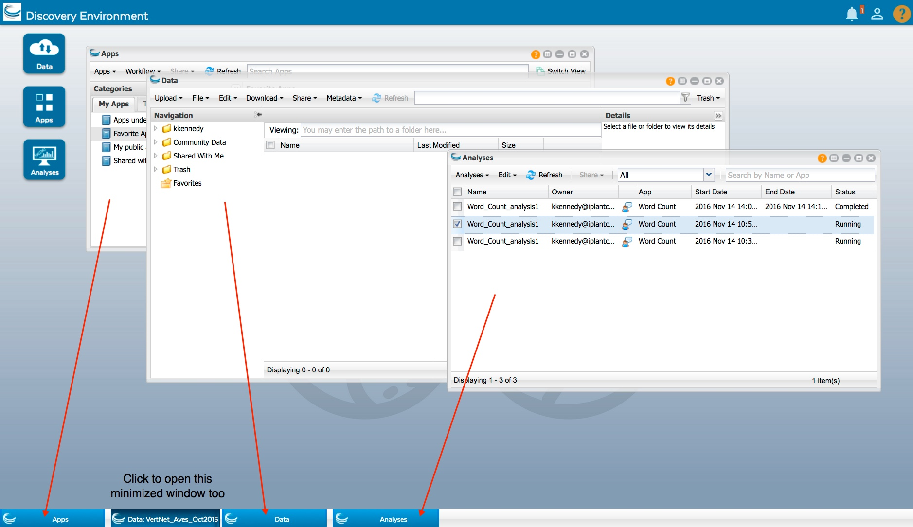

.. include:: cyverse_rst_defined_substitutions.txt

|CyVerse logo|_

|Home_Icon|_
`Learning Center Home <http://learning.cyverse.org/>`_

===================================
**Using the Discovery Environment**
===================================

Welcome to the user manual for the CyVerse Discovery Environment (DE). Here you'll find all the how-to instructions for using the DE. 
To get you started, you may want to read through the introductory information in the Quick Links. 
Hints for how to use this manual are also on this page.

Table of Contents
-----------------

.. toctree::
      :titlesonly:

      using_DEchildpages/logIn-out-DE
      using_DEchildpages/using-preferences-menu
      using_DEchildpages/Viewing-deleting-notifications
      using_DEchildpages/Feedback-Help

**Navigating the app**
----------------------
While much of the interface is intuitive and easy to use, there are a few tips to keep in mind as you move between windows in the DE.

Main Icons
----------
At the top right of every DE screen are the main icons:

.. |notification_icon| image:: img/de/NotificationsIcon.png

.. |person_icon| image:: img/de/person_icon.png

.. list-table::
    :header-rows: 0
    
    * - |notification_icon|
      - Lists status update `notifications <https://wiki.cyverse.org/wiki/display/DEmanual/Viewing+and+Deleting+Notifications>`_ and information about data or analyses actions.
    * - |person_icon| 
      - Links to setting `preferences <https://wiki.cyverse.org/wiki/display/DEmanual/Using+the+Preferences+Menu>`_; viewing or editing the Collaborators list; viewing system messages, documentation, Introduction to DE, and release information; contacting CyVerse Support; and logging out of the DE.
    * - |help_icon|
      - **Click to access the FAQs page or Ask CyVerse, and to submit feedback or contact Support.**

Open window icons
-----------------
At the top right of each data, apps, or analyses window are icons to help you learn more about the DE, and manage the window's size and display. 

.. list-table::
    :header-rows: 0

    * - |helpiconwindow|
      - **Help:** Click to open the FAQs page for the current window. 
    * - |WindowIcon-cascadeTile|
      - **Layout:** Resizes the window layout to half of the available available desktop space and positions it either to the left (**Snap Left**) or right side (**Snap Right**) of the window.
    * - |WindowIcon-minMaxClose|
      - Minimize, Maximize, or close the active window. 

Open window tabs
----------------
The tabs that are displayed at the bottom of the Data, Apps, or Analyses screen are the apps, files, and windows that are currently open. Click a tab to quickly open the window.

Clikcing the **Data** desktop icon when `multiple Data windows <https://wiki.cyverse.org/wiki/display/DEmanual/Opening+New+Data+Windows>`_ are open and minimized to a bottom tab opens the most recent window, cycling through each consecutive open Data window in the reverse order in which they were opened.

Layout (Snap Left or Snap Right), Minimize/Maximize, and Close window icons
-------------------------------------
At the top right of each data, apps, or analyses window are icons to help you learn more about the DE, and manage the window's size and display.

.. list-table::
    :header-rows: 0

    * - |helpiconwindow|
      - **Help:** Click to open the FAQs page for the current window. 
    * - |WindowIcon-cascadeTile|
      - **Layout:** Resizes the window layout to half of the available available desktop space and positions it either to the left (**Snap Left**) or right side (**Snap Right**) of the window.
    * - |WindowIcon-minMaxClose|
      - Minimize, Maximize, or close the active window. 

----

**Fix or improve this documentation:**

- On Github: |Github Repo Link|
- Send feedback: `Tutorials@CyVerse.org <Tutorials@CyVerse.org>`_
- Live chat/help: Click on the |intercom| on the bottom-right of the page for questions on documentation

----

|Home_Icon|_
`Learning Center Home <http://learning.cyverse.org/>`_

.. Comment: Place Images Below This Line
   use :width: to give a desired width for your image
   use :height: to give a desired height for your image
   replace the image name/location and URL if hyperlinked

 .. |Clickable hyperlinked image| image:: ./img/IMAGENAME.png
    :width: 500
    :height: 100
 .. _CyVerse logo: http://learning.cyverse.org/

 .. |Static image| image:: ./img/IMAGENAME.png
    :width: 25
    :height: 25